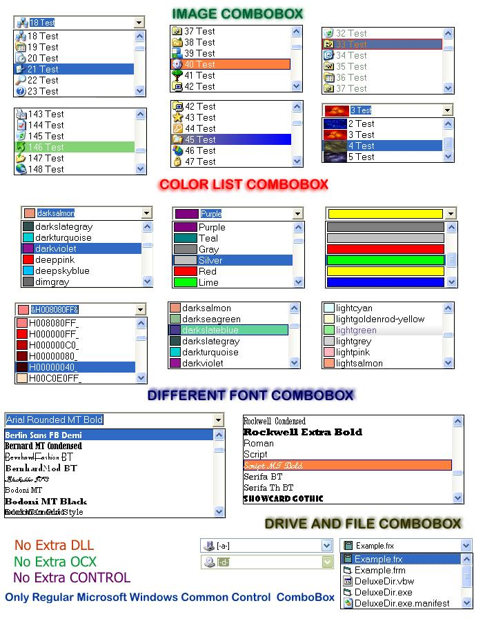



## Deluxe Combo Box Class

### Description

Extend the Combo Box capabilities with amazing results, turn the original and common Combo Box into a Color Picker , Font Picker or add Pictures, even create a new style Drive Combo Box, and more!! Now you can add Colorful list styles like gradient or office style, all this without replacing or adding any control. This class will help you build a professional and enhanced GUI, See how you can turn a Regular Combo Box into a Owner Draw Combo (All Written Down in a Doc File)

Any enhancement suggestion or other constructive criticism is welcome, The code has been tested in Windows XP PRO and Windows 2000 With VB 6 SP5, but it should work with windows 98 and above. Please read the Doc File for any doubts or read the code as well, if you have any question at all e-mail-me.

This Code Was Made in Cd Juarez Chihuahua Mexico.

Remember:

Commercial use of this code is FORBIDDEN

Distribution notice:

You are free to distribute the included zip file in it's original state to any

public WWW site, online service or BBS without explicitly obtaining

the author’s permission. (Notification would be greatly appreciated

though!).
 
### More Info
 

             |
---                |---
**Submitted On**   |2004-06-27 14:23:04
**By**             |[MArio Flores G](https://github.com/Planet-Source-Code/PSCIndex/blob/master/ByAuthor/mario-flores-g.md)
**Level**          |Advanced
**User Rating**    |4.6 (64 globes from 14 users)
**Compatibility**  |VB 6\.0
**Category**       |[Graphics](https://github.com/Planet-Source-Code/PSCIndex/blob/master/ByCategory/graphics__1-46.md)
**World**          |[Visual Basic](https://github.com/Planet-Source-Code/PSCIndex/blob/master/ByWorld/visual-basic.md)
**Archive File**   |[Deluxe\_Com176427712004\.zip](https://github.com/Planet-Source-Code/mario-flores-g-deluxe-combo-box-class__1-54678/archive/master.zip)

